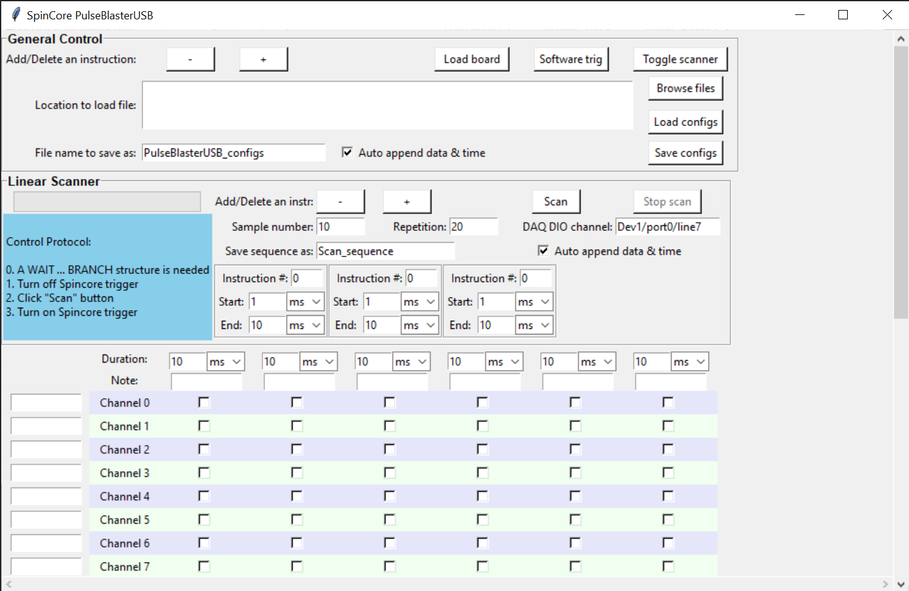

# SpinCore-Python-Control

This GUI is designed to interface with [SpinCore PulseblasterUSB](https://www.spincore.com/products/PulseBlasterUSB/) for TTL pulse generation.

The usage is straightforward: use checkboxes to indicate channels to turn on in various time slots. For device specification, _op code_, _op data_, etc. please refer to [product manual](http://www.spincore.com/CD/PulseBlasterUSB/v2/PulseBlasterUSB_v2_manual.pdf). Use _Load board_ button to load configurations into SpinCore PulseBlasterUSB device. This GUI also supports locally saving and loading program settings.

## Scanner
The built-in _scanner_ allows users to scan duration of chosen time slots. Scanning parameters are sampled linearly from user defined _start_ to _end_. Multiple time slots are scanned synchronously. That is to say, although the scan sequence can be randomized, when the first time slot has a certain value, all following time slots will have their corresponding values (not random) at that moment. This is useful, for example, when we want the total duration of all time slots to be fixed. We can achieve this by scanning different time slots in opposite directions. Or another application is that sometimes we want to scan the timing of some TTL channels but leave the other channels uninterrupted. This can be done by splitting the desired time slot into two, and scan them in the opposite directions while keeping total duration to be fixed. For channels that need to scan, turn them on in only one slot; for other channels, turn them on (or off) in both parts.   

The implementation of _Scanner_ requires loading parameters into hardware in every experimental cycle. To synchronize parameter loading with experimental cycles, the _WAITING_ signal returned by SpinCore PulseBlasterUSB device is used. It will be read by an NI DAQ bufferable DIO channel and trigger the program for new parameter loading. 
